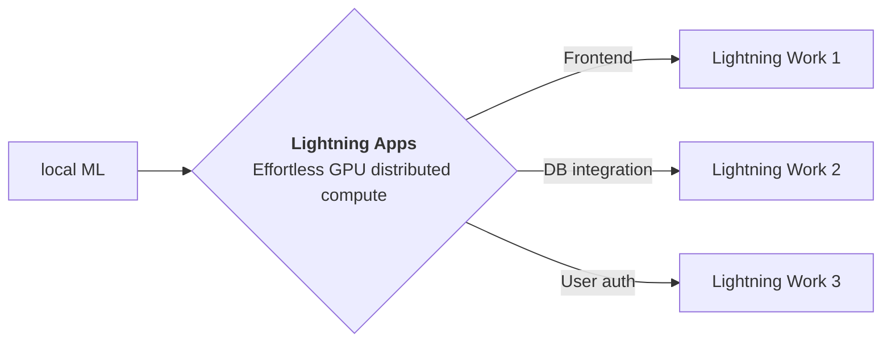

<div style="height: 90pt;"></div>
<div style="flex: 0 0 16%; margin-top: -10pt;">

</div>
<div style="flex: 0 0 65%; text-align: center;">
<h1 style="margin-bottom: 10pt;">Demo: Masked Autoencoders</h1>
<h2>A demo of Masked Autoencoders research paper using Lightning App</h2>
</div>
<div style="flex: 1">
    <div style="display: flex; align-items: center;">
        
        <div style="font-size: 0.9rem; margin-right: 5pt;"><a href="https://github.com/facebookresearch/">facebookresearch</a></div>
    </div>
    <div style="display: flex; align-items: center;">
        
        <div style="font-size: 0.9rem;"><a href="https://twitter.com/MetaAI">@MetaAI</a></div>
    </div>
</div>

--split--

# Masked Autoencoders: A PyTorch Implementation

## This paper by Facebook Research shows that masked autoencoders (MAE) are scalable self-supervised learners for computer vision.

This app is a demo
of [Lightning Research Template app](https://github.com/Lightning-AI/lightning-template-research-app) which allows
authors to build an app to share their everything
related to their work at a single place.
Explore the tabs at the top of this app to view blog, paper, training logs and model demo.

You can fork this app and edit to customize according to your need.

Thanks to [Facebook Research](https://github.com/facebookresearch) for open-sourcing
the [MAE](https://github.com/facebookresearch/mae)
codebase.


This paper masks random patches of the input image and reconstruct the missing pixels. It is based on two core designs.
First, the authors
develop an asymmetric encoder-decoder architecture, with an encoder that operates only on the visible subset of
patches (without mask tokens), along with a lightweight decoder that reconstructs the original image from the latent
representation and mask tokens. Second, the authors find that masking a high proportion of the input image, e.g., 75%,
yields a nontrivial and meaningful self-supervisory task.

--split--

# Lightning Apps

## Lightning Apps can be built for any AI use case, including AI research, fault-tolerant production-ready pipelines, and everything in between.

!!! abstract "Key Features"

    - **Easy to use-** Lightning apps follow the Lightning philosophy- easy to read, modular, intuitive, pythonic and highly composable interface that allows you to focus on what's important for you, and automate the rest.
    - **Easy to scale**- Lightning provides a common experience locally and in the cloud. The Lightning.ai cloud platform abstracts the infrastructure, so you can run your apps at any scale. The modular and composable framework allows for simpler testing and debugging.
    - **Leverage the power of the community-** Lightning.ai offers a variety of apps for any use case you can use as is or build upon. By following the best MLOps practices provided through the apps and documentation you can deploy state-of-the-art ML applications in days, not months.



### Available at : `Lightning-AI/lightning-template-research-app/app.py`

```python
import lightning as L

poster_dir = "resources"
paper = "https://arxiv.org/pdf/2111.06377v2.pdf"
github = "https://github.com/facebookresearch/mae"
tabs = ["Poster", "Notebook Viewer", "Paper", "Model Demo"]

app = L.LightningApp(
    ResearchApp(
        poster_dir=poster_dir,
        paper=paper,
        github=github,
        notebook_path="resources/mae_visualize.ipynb",
        launch_gradio=True,
        tab_order=tabs,
        launch_jupyter_lab=False,  # don't launch for public app, can expose to security vulnerability
    )
)

```

### Citation

```bibtex

@article{YourName,
  title={Your Title},
  author={Your team},
  journal={Location},
  year={Year}
}

```
